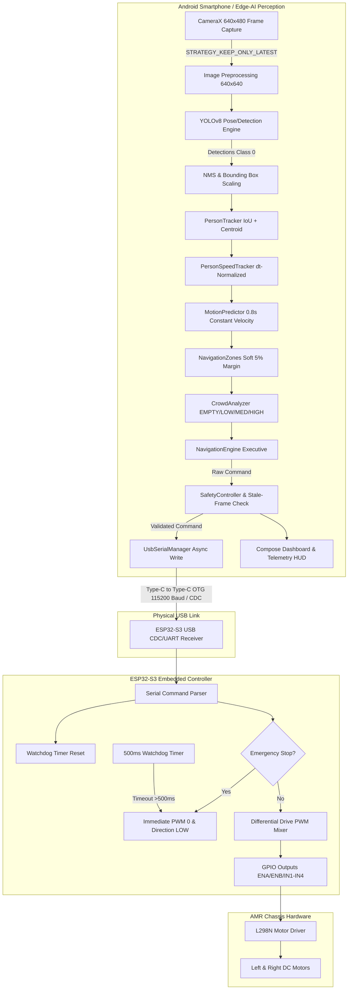

# Architecture Verification Report

## 1. System Architecture Diagram

---

## 2. Architecture Conformance Verification

| Requirement | Design Specification | Actual Implementation | Conformance Status |
| :--- | :--- | :--- | :--- |
| **Perception Allocation** | On Android smartphone | Android CameraX + TFLite/ONNX in `AMRAndroid/` | **VERIFIED** |
| **Navigation Executive** | On Android smartphone | `NavigationEngine.kt` in Kotlin | **VERIFIED** |
| **Motor & Safety Failsafe** | On ESP32-S3 | `esp32_s3_motor_controller.ino` with 500ms Watchdog | **VERIFIED** |
| **Transport Layer** | USB-C OTG Serial | `UsbSerialManager.kt` via `usb-serial-for-android` | **VERIFIED** |
| **Offline Independence** | Operates without laptop | Phone directly drives ESP32-S3 via Type-C | **VERIFIED** |
